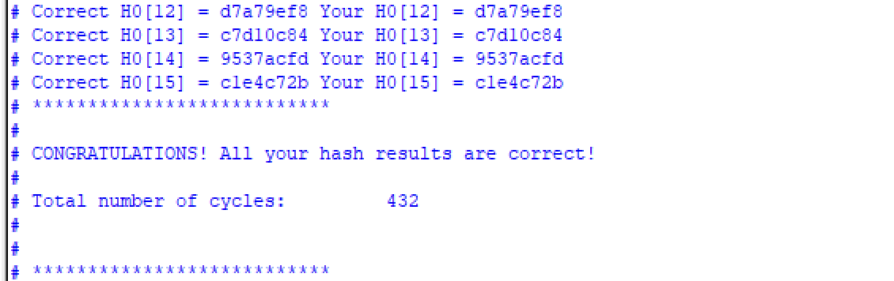

# Bitcoin SHA-256 FPGA Accelerator

SystemVerilog implementation of Bitcoin double-SHA-256 hashing, synthesized for an Intel Arria II GX FPGA (EP2AGX45DF29I5). The design hashes a block header across 16 nonces and was built in four stages, from a baseline SHA-256 core to an 8-way parallel Bitcoin hasher.

All four designs pass the course self-checking testbenches in Questa.

## Results

### Bitcoin hashing (16 nonces)

| Design | ALUTs | Registers | Fmax | Cycles | Total time |
|---|---|---|---|---|---|
| Serial, w[64] | 9,837 | 8,200 | 104.5 MHz | 2,320 | 22.20 µs |
| 8-way parallel, w[16] | 15,857 | 16,364 | 110.3 MHz | 432 | 3.92 µs |

**5.67× faster** for 1.61× the ALUTs and 2.0× the registers. The parallel design uses 86% of the device's logic and 99% of its LABs.

### SHA-256 core (single message)

| Design | ALUTs | Registers | Fmax | Cycles | Total time |
|---|---|---|---|---|---|
| Baseline, w[64] | 3,760 | 3,295 | 105.5 MHz | 187 | 1.77 µs |
| Optimized, w[16] | 2,184 | 1,765 | 141.1 MHz | 201 | 1.42 µs |

The w[16] core uses **46% fewer registers and 42% fewer ALUTs**, and runs **34% faster in Fmax**. It takes 14 more cycles, but the higher clock still makes it 1.24× faster end to end.

Total time = cycles / Fmax. Fmax is taken from the Slow 900mV 100C timing model.

## Key optimization: 16-word rolling window

SHA-256 expands each 512-bit block into 64 message words:

```
W[t] = σ1(W[t-2]) + W[t-7] + σ0(W[t-15]) + W[t-16]
```

The baseline stores all 64 words. Reading W[t-2], W[t-7], W[t-15] and W[t-16] at a changing index `t` makes synthesis build wide 64-to-1 multiplexers, and the 64 × 32-bit array was the largest consumer of registers in the design.

The optimized core keeps only the last 16 words and shifts the window by one each round. That puts the four operands at fixed positions (`w[14]`, `w[9]`, `w[1]`, `w[0]`), so the multiplexers disappear and word storage drops by 75%. The logic this frees up is what allows eight hashing lanes to fit on the device.

## Architecture

- **`bitcoin_sha`**: a reusable single-block SHA-256 core. It takes an initial hash state (h0–h7) and a 16-word message block, and returns the updated hash state with a one-cycle `done` pulse.
- **`bitcoin_hash`**: the top-level controller. The first 64 bytes of the block header do not depend on the nonce, so they are hashed once (phase 1). Eight lanes then run phase 2 (the rest of the header plus the nonce) and phase 3 (the second SHA-256 pass) in parallel. This covers 16 nonces in two passes, and `H0` of each result is written to memory.

## Synthesis settings

- Device: Arria II GX EP2AGX45DF29I5
- Tool: Quartus Prime 21.1.1, Balanced optimization
- Auto RAM / ROM / Shift Register Replacement: Off
- No block memory, no inferred latches, single clock (`clk`)

## Repository layout

| Folder | Design | Source files |
|---|---|---|
| `SHA256-w64/` | Baseline SHA-256 core | `meit_simplified_sha256.sv` |
| `SHA256-w16/` | Optimized SHA-256 core | `meit_optimized_sha256.sv` |
| `Bitcoin-Serial-w64/` | Serial Bitcoin hasher | `meit_bitcoin_hash.sv`, `meit_bitcoin_sha.sv` |
| `Bitcoin-Parallel-w16/` | 8-way parallel Bitcoin hasher | `meit_bitcoin_hash_opt.sv`, `meit_bitcoin_sha_opt.sv` |

Each folder also contains its testbench (`tb_*.sv`). The testbenches were not written by me.

`results/` has one subfolder per design with the same names. Each one contains the Quartus fitter report (`.fit.rpt`), the timing report (`.sta.rpt`), and a screenshot of the passing simulation.

## Simulation

8-way parallel design, all 16 nonces correct:




